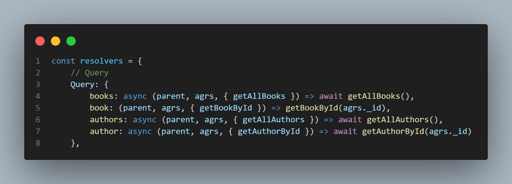

# Learn GraphQL

## GraphQL là gì?
* GraphQL là ngôn ngữ truy vấn dữ liệu cho API, nhằm giúp cho phía client có cách thức dể dàng request những dữ liệu phía client cần. Vì chỉ cần một endpoint mà phía client vẫn có thể linh hoạt request chính xác dữ liệu cần nên API GraphQL dể dành trở nên linh hoạt.

## Lợi ích của GrahQL khi dùng cho dự án
1. Tiết kiệm lưu lượng mạng: GraphQL cho phép người dùng chỉ trả về dữ liệu cần thiết, không gửi những dữ liệu dư thừa. Điều này giúp giảm bớt lưu lượng mạng và tăng tốc độ tải trang.
2. Hiệu suất và tốc độ: Với GraphQL, người dùng có thể chỉ định chính xác dữ liệu mà họ muốn nhận từ API. Điều này giúp tối ưu hóa hiệu suất và tốc độ của ứng dụng, vì chỉ có dữ liệu cần thiết được truyền qua mạng.
3. Linh hoạt và mở rộng: GraphQL cho phép người dùng truy vấn dữ liệu từ nhiều nguồn dữ liệu khác nhau trong một truy vấn duy nhất. Điều này giúp tổ chức dữ liệu trở nên linh hoạt và dễ dàng mở rộng.
4. Tích hợp dễ dàng: GraphQL có thể tích hợp với nhiều ngôn ngữ lập trình và framework khác nhau, như JavaScript, Ruby, Python, PHP và nhiều hơn nữa. Điều này giúp cho việc tích hợp và phát triển dự án phần mềm trở nên thuận tiện và linh hoạt hơn.
5. Tính nhất quán và linh hoạt: Với GraphQL, dữ liệu được trả về theo cấu trúc mô tả trong schema. Điều này giúp đảm bảo tính nhất quán và linh hoạt trong việc truy vấn và sử dụng dữ liệu.
6. Hỗ trợ real-time: GraphQL hỗ trợ subscriptions, cho phép người dùng nhận thông báo khi có sự thay đổi trong dữ liệu. Điều này rất hữu ích cho các ứng dụng thời gian thực như chat hoặc cập nhật dữ liệu theo thời gian thực.

## Nhược điểm của GrapQL
1. Khả năng quản lý bộ nhớ: GraphQL không cung cấp một cơ chế tự động để quản lý bộ nhớ cache như REST. Điều này có thể dẫn đến việc phải tự quản lý cache để tối ưu hiệu suất và tốc độ của ứng dụng. Nhưng nếu muốn Cache thì phải dùng thư viên riêng để implement
2. Tính bảo mật: GraphQL không cung cấp các tính năng bảo mật tích hợp như xác thực và phân quyền dữ liệu. Điều này đòi hỏi người phát triển phải tự thêm các lớp bảo mật để đảm bảo rằng chỉ có người dùng được ủy quyền mới có thể truy cập vào dữ liệu.
3. Hỗ trợ công cụ: Mặc dù có nhiều công cụ hỗ trợ cho GraphQL như GraphiQL và GraphQL Playground, nhưng còn hạn chế so với các công cụ hỗ trợ cho REST. Điều này có thể làm khó khăn trong việc phát triển, gỡ lỗi và kiểm thử các dự án GraphQL.
4. Thay đổi phiên bản: Khi schema GraphQL thay đổi, các khách hàng cũng cần phải cập nhật truy vấn của họ để phù hợp với schema mới. Điều này có thể gây ra sự phiền toái và khó khăn trong việc quản lý các phiên bản và tương thích ngược.
5. Khả năng quản lý truy vấn phức tạp: Trong các ứng dụng lớn và phức tạp, việc quản lý các truy vấn GraphQL có thể trở nên phức tạp. Điều này đòi hỏi sự quản lý kỹ lưỡng để đảm bảo hiệu suất và hiệu quả của hệ thống.

## Kiến trúc GrapQL

- Ảnh ví dụ Query và response trong GraphQL

## Kiến thức và khái niệm trong GraphQL

### Schema
- Schema là một phần của việc định nghĩa cấu trúc dữ liệu và quy tắc truy vấn của một GraphQL API. Nó mô tả các trường dữ liệu có thể được truy vấn và quan hệ giữa chúng. Gồm hai phần chính: các loại dữ liệu (type) và các trường (field). Sử dụng cú pháp GraphQL Schema Definition Language (SDL)
    1. Các loại dữ liệu (type): 
        - Object types: Đại diện cho các đối tượng trong hệ thống. Ví dụ: User, Post, Comment.
        - Scalar types: Đại diện cho các kiểu dữ liệu cơ bản như String, Int, Float, Boolean, ID.
    2. Các trường (field): 
        - Mỗi loại dữ liệu trong schema có thể có các trường, đại diện cho các thuộc tính hoặc quan hệ của đối tượng đó. Ví dụ: trong loại User, có thể có các trường như id, name, email.    
        

### Resolver
- Resolver trong GraphQL là một hàm hoặc phương thức được sử dụng để thực hiện các truy vấn và mutations trong GraphQL API. Resolver có nhiệm vụ xử lý và trả về dữ liệu tương ứng cho các trường được yêu cầu trong truy vấn.

### Context
- Context trong GraphQL là một đối tượng chứa thông tin và dữ liệu liên quan đến một truy vấn GraphQL.
- Context thường được truyền vào trong mỗi resolver và có thể chứa các thông tin như đối tượng đăng nhập của người dùng, cấu hình hệ thống, trạng thái ứng dụng, hay bất kỳ dữ liệu nào khác cần được truy cập từ các resolver.
- Một số điểm về Context trong GraphQL:
    1. Truyền Context: Context thường được truyền vào trong các tham số của resolver function
    2. Chia sẻ dữ liệu: Context cho phép chia sẻ dữ liệu và trạng thái giữa các resolver.
    3. Middleware và Context: Context cũng có thể được sử dụng trong các middleware của GraphQL.
    4. Tùy chỉnh Context: Context có thể được tùy chỉnh để chứa bất kỳ dữ liệu nào cần thiết cho ứng dụng cụ thể. 

### Query
- Query là một loại truy vấn được sử dụng để Lấy Dữ Liệu từ GraphQL API. Nó cho phép người dùng chỉ định các trường dữ liệu mà họ muốn lấy và cấu trúc dữ liệu trả về sẽ phản ánh chính xác yêu cầu của người dùng.

### Mutation
- Mutation là một loại truy vấn được sử dụng để thay đổi dữ liệu trong GraphQL API. Nó cho phép người dùng thực hiện các thao tác như thêm, sửa đổi hoặc xóa dữ liệu từ nguồn dữ liệu.

### Subcribe
- Subscription là một cơ chế cho phép người dùng đăng ký và nhận các cập nhật thời gian thực từ GraphQL API. Nó cho phép các ứng dụng và máy khách theo dõi và nhận thông báo khi có sự thay đổi trong dữ liệu.
- Cơ chế subscribe trong GraphQL được sử dụng chủ yếu cho các trường dữ liệu có tính chất real-time hoặc đòi hỏi cập nhật thời gian thực như thông báo, tin nhắn, hoặc dữ liệu đồng bộ.

## Sử dụng Apollo Server và Apollo Client để kết nối Backend và Frontend

### Kiến trúc Apollo

### Giao diện test GraphQL trên Apollo

